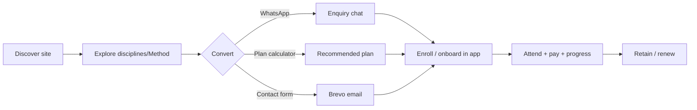

# Phase 1 — Business & Product

> Where the repository evidences a fact, it is cited. Commercial specifics not in the repo are flagged **`[Needs Verification]`** and must be confirmed with the academy owner.

## Business Model

A **yoga / fitness / wellness academy** (Lucknow) monetized through **membership-based class enrollment**. Software supports two funnels: (1) public site → enquiry/WhatsApp → enrollment; (2) in-app operations (attendance, payments, progress) that retain members. (Source: website README.)

## Revenue Model

Membership plans paid via **UPI** (manual QR + screenshot verification — ADR-0006). Plan + expiry tracked on `payments` (`plan_name`, `plan_expiration_date`). **Pricing values are placeholders in-repo** → `[Needs Verification]`.

## User Personas

| Persona | Needs | Surface |
|---|---|---|
| Prospective student | Understand practice, see schedule/pricing, enquire | Website |
| Enrolled student | Attend, pay, track progress, get guidance | App (student shell) |
| Trainer | Mark attendance, manage students, guide | App (trainer shell) |
| Admin/owner | Run academy: members, payments, reports, content | App (admin shell) + Sanity |

Detailed journeys: [design/15-user-journeys.md](../divinity-third-eye/divinity/design/15-user-journeys.md).

## Customer Journey

## Market Position

Premium, breath-centred, design-led academy presence (award-quality web). Differentiator = experience quality + integrated ops app. Benchmarks: [design/05-benchmark-product-leaders.md](../divinity-third-eye/divinity/design/05-benchmark-product-leaders.md).

## Competitor Analysis

`[Needs Verification]`: not in repo. Use `Divinity:market-research` / competitive skills to populate. (Likely competitors: local yoga studios, fitness chains, generic class-booking apps.)

## Pricing

`[Needs Verification]`: real fees not committed (README checklist: "Replace placeholder membership prices"). Plan tiers structured via Sanity `plan.ts` + `lib/content.ts` + `PlanCalculator`/`recommend.ts`.

## Membership Plans

Plan recommendation is code: `lib/recommend.ts` (pure, tested) maps user inputs → a plan in the `PlanCalculator`. Plan content from Sanity/fallback. Expiry enforced via `payments.plan_expiration_date`.

## Business Rules

- Enrollment is staff-driven (`enrollments` insert = trainer/admin).
- Payment requires verification before benefits (state machine).
- Attendance requires presence at the batch location (geofence).
- Roles strictly separate capabilities (RLS).

## KPIs

Enquiry volume, conversion rate, active members, attendance rate, streaks, payment completion, renewal rate. Metric sources in [23_Data_Analytics](23_Data_Analytics.md); success metrics in [design/24-success-metrics.md](../divinity-third-eye/divinity/design/24-success-metrics.md).

## Future Vision

Native apps (ADR-0009 PWA→native), richer progress/diet programs, possibly self-booking and a payment gateway. See [21_Future_Roadmap](21_Future_Roadmap.md).
