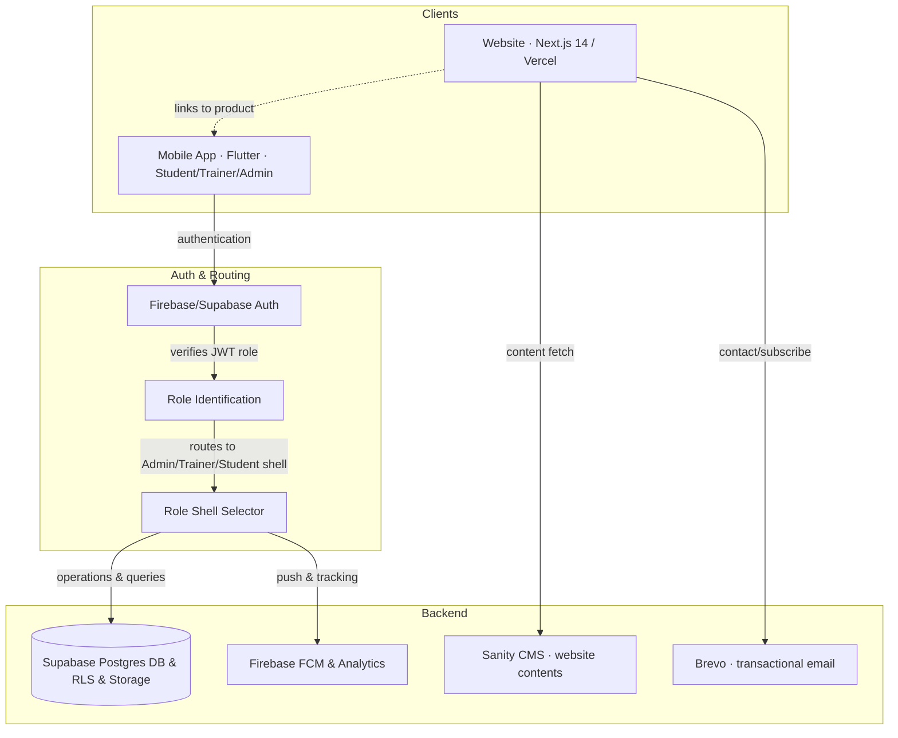
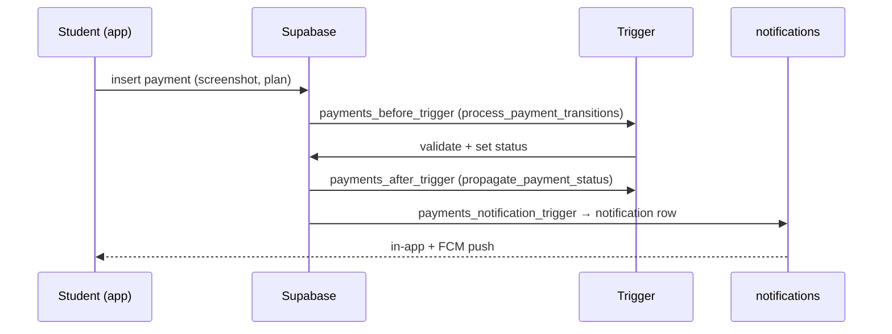

# Phase 3 — System Architecture

> Sources: [Divinity/docs/architecture.md](../Divinity/docs/architecture.md), [design/adr](../divinity-third-eye/divinity/design/adr/), live source.

## High-Level Architecture

The Divinity ecosystem operates as a multi-surface platform (marketing website + native mobile app for Android/iOS) powered by Firebase Auth, Supabase DB, and role-based operational shells:



### Complete Ecosystem Data & Auth Pathway

```
                         WEBSITE           MOBILE APP
                    (Visitors/Members)    (Android/iOS)
                             │                 │
                             └──────┬──────────┘
                                    │
                             Firebase Authentication
                   (Google • Mobile OTP • Email/Password)
                                    │
                                    ▼
                          Role Identification
                                    │
      ┌─────────────────────────────┼────────────────────────────┐
      │                             │                            │
      ▼                             ▼                            ▼
   ADMIN                        TRAINER                      STUDENT
      │                             │                            │
      └─────────────────────────────┼────────────────────────────┘
                                    │
                            Backend API Server (Supabase PostgreSQL + RLS)
                                    │
      ┌──────────────┬──────────────┬──────────────┬─────────────┐
      │              │              │              │
  Supabase DB   Firebase Storage   Notifications   Analytics
```

- The **website** is a (largely static) marketing front door. It has **no auth and no Supabase dependency** — by deliberate scope (ADR + website README). Its only server work is two rate-limited API routes (Brevo email) and optional Sanity content.
- The **app** is the operational product. All business data lives in **Supabase Postgres**, protected by RLS; **Firebase** is used for authentication, messaging, analytics, and crash monitoring. Users are segregated by roles in `app_metadata.role` mapping to specialized UI routing shells.

## Micro / Macro Architecture

- **Macro:** clients ↔ backend-as-a-service. No custom long-running API server for the app (Supabase is the API). The website is serverless (Vercel functions for `/api/*`).
- **Micro (app):** feature-first modules, each split into `data` (repositories ↔ Supabase), `domain` (immutable models), `presentation` (Riverpod providers + screens).
- **Micro (web):** RSC pages compose section components; logic isolated in pure `lib/` helpers.

## Service Boundaries

| Concern | Owner | Notes |
|---|---|---|
| Identity & access | Supabase Auth + RLS | OTP login, JWT role in `app_metadata` |
| Business data | Supabase Postgres | 12 tables, RPCs, triggers |
| File storage | Supabase Storage | payment screenshots (RLS) |
| Push / analytics / crash | Firebase | FCM, Analytics, Crashlytics |
| Marketing content | Sanity (optional) → `lib/content.ts` fallback | |
| Email | Brevo | contact + newsletter |

## Rendering Strategy

- **Web:** App Router with Server Components by default; **client islands** for motion/interactivity (cursor, command palette, plan calculator) — ADR-0008. Dynamic detail routes (`services/[slug]`, `blog/[slug]`, `events/[slug]`) are statically generated (SSG). (Source: website README "Structure")
- **App:** declarative Flutter widget tree; GoRouter drives navigation; role shells select the tab set.

## Data Flow

1. **Web content:** `lib/content.ts` provides the source of truth; if Sanity env vars are set, `lib/sanity.ts` `fetchOrFallback` overrides values. SSG bakes pages; CDN serves them.
2. **App data:** screen → Riverpod provider → repository → `supabase_flutter` client → Postgres (RLS-checked) → back as typed domain model.
3. **Writes:** repositories call Supabase insert/update or **RPCs** (`check_in`, `convert_lead_to_member`); triggers enforce invariants and emit notifications.

## Event Flow



## Sequence Diagrams

- **OTP login → role routing:** see [10_Auth_Authorization](10_Auth_Authorization.md).
- **Geofenced check-in:** see [05_Student_Mobile_App](05_Student_Mobile_App.md) and `check_in` RPC in [09_Database](09_Database.md).
- **Lead → member conversion:** `convert_lead_to_member` RPC (migration 020).

## Component Communication

- **App:** providers expose state; widgets watch/read; repositories are the only Supabase touchpoint (clean dependency direction presentation → data).
- **Web:** props down; shared state minimal (motion providers, command palette); URL is the primary state.

## State Flow

- **App:** Riverpod `StateNotifier`/generated providers per feature; auth state (`auth_state.dart`) gates the router redirect logic.
- **Web:** mostly stateless render; `MotionProvider`, `SmoothScroll`, `CommandPalette` hold UI-only state.

## Architecture Decision Records (ADRs)

12 web ADRs in [design/adr/](../divinity-third-eye/divinity/design/adr/):

| ADR | Decision |
|---|---|
| 0001 | Single-page static architecture |
| 0002 | GSAP vs Framer Motion (use both, scoped) |
| 0003 | Lenis vs native scroll |
| 0004 | CMS or fallback content |
| 0005 | Brevo transactional email |
| 0006 | UPI QR payments |
| 0007 | next/image local assets |
| 0008 | RSC + client-island strategy |
| 0009 | PWA now, native later |
| 0010 | Offline-first strategy |
| 0011 | Supabase vs Firebase (Supabase primary) |
| 0012 | No user theme toggle |

Cross-cutting/app-level decisions are tracked in [DECISION_LOG.md](DECISION_LOG.md).
