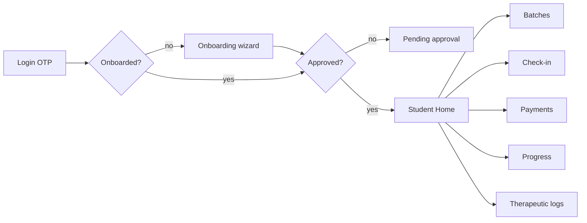

# Phase 5 — Student Mobile App

> `divinity_flutter/` (Flutter, Riverpod, GoRouter, Supabase, Firebase). The student is the default role; the same binary serves trainers/admins via role shells. Sources: [`lib/features/`](../divinity_flutter/lib/features/).

## Screens (student-facing)

| Area | Screen file | Purpose |
|---|---|---|
| Auth | `login_screen`, `otp_screen`, `reset_password_screen` | passwordless OTP login |
| Onboarding | `onboarding_wizard` + steps (name, age/gender, goal, health, emergency_contact) | profile completion |
| Gate | `pending_approval_screen` | awaiting admin activation |
| Home | `student_home_screen` | dashboard: today's batch, streak, notices |
| Batches | `batches_screen` | enrolled classes |
| Attendance | `check_in_screen`, `attendance_history_screen` | geofenced check-in + history |
| Leave | `leave_request_screen` | apply for leave |
| Payments | `payments_screen`, `record_payment_sheet` | view dues, upload UPI screenshot |
| Progress | `student_progress_detail_screen`, `third_eye_dashboard_screen` | transformation scores |
| Therapeutic | `therapeutic_logs_screen` | diet/therapeutic notes + trainer comments |
| Holidays | `holidays_screen` | academy calendar |
| Notifications | `notifications_screen` | in-app inbox |
| Profile | `profile_screen` | edit non-privileged profile |

## Navigation

GoRouter (`core/router/app_router.dart`) with custom transitions (`app_transitions.dart`). `student_shell.dart` provides the bottom-nav/tab set; redirect logic routes by auth + onboarded + pending state. (See [10_Auth_Authorization](10_Auth_Authorization.md).)

## User Flow

## Features

- **Attendance (geofenced):** `check_in_screen` calls the `check_in` RPC; `geolocator` provides location, validated server-side against batch coordinates + `radius_meters` (`haversine_m`). Streaks recalculated by trigger. ([09_Database](09_Database.md))
- **AI Wellness Assistant:** Client-side Gemini queries using the free Spark-compatible `FirebaseAI.googleAI()` instance, with prompts configured dynamically on the server-side via Firebase Remote Config parameter keys (`ai_model_name`, `ai_system_instruction`). Secured using Firebase App Check (`app_check_service.dart`).
- **Payments:** upload UPI payment screenshot (`image_picker`) → Supabase Storage → `payments` row; admin/trainer verify; status + expiry tracked; notification on change.
- **Progress / "Third Eye":** `transformation_scores` visualized with `fl_chart` (`third_eye_dashboard_screen`).
- **Therapeutic / diet:** `therapeutic_logs` with trainer comments (see Diet Plans below).
- **Holidays & schedule:** `table_calendar` for academy calendar.
- **Notifications:** in-app list + push (FCM).

## Offline Behaviour

- `shared_preferences` caches session/light state. ADR-0010 (offline-first strategy) and ADR-0009 (PWA now/native later) document intent.
- **`[Needs Verification]`:** extent of offline data caching for batches/attendance is not fully evidenced in code — confirm whether reads are cached or network-only.

## Notifications

Firebase Cloud Messaging via `services/fcm_service.dart` + `fcm_provider.dart`; `notification_bell.dart` widget; deep-linking to relevant screens (recent commit: "FCM deep linking"). Backed by the `notifications` table + `handle_payment_notification` trigger. See [24_Communication_Notifications](24_Communication_Notifications.md).

## Payments

Manual **UPI QR** model (ADR-0006): student pays via UPI, uploads screenshot, staff verifies. Fields: `plan_name`, `screenshot_url`, `admin_approved`, `receipt_given_by_trainer`, `plan_expiration_date`. State machine in migrations 022/023.

## Progress Tracking

`transformation_scores` table → `transformation` feature (provider + detail + dashboard). Charts via `fl_chart`.

## Diet Plans

Represented by `therapeutic_logs` (notes + `trainer_comment` + `comment_timestamp`, migration 013). **`[Needs Verification]`:** whether a structured diet-plan entity (separate from therapeutic logs) is planned.

## Attendance

See Features. History via `attendance_history_screen`; streak logic via `recalculate_student_streaks`/`on_attendance_change`.

## Booking

**`[Needs Verification]`:** no explicit class-booking flow found (enrollment is staff-driven via `enrollments`). Confirm if self-booking is on the roadmap. See [21_Future_Roadmap](21_Future_Roadmap.md).

## Sync Strategy

Supabase realtime/refetch on screen load via Riverpod providers; writes go through repositories/RPCs. Conflict handling relies on DB constraints/triggers. `[Needs Verification]` for explicit realtime subscriptions vs. pull-to-refresh.
