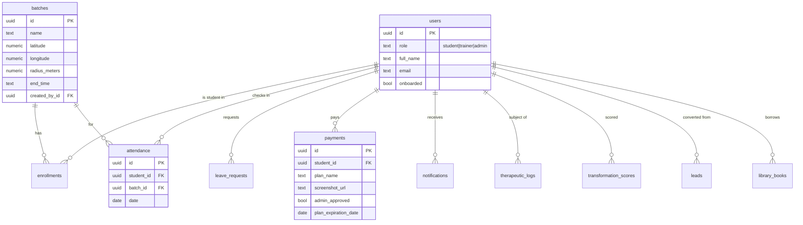

# Phase 9 — Database

> Source of truth: [`divinity_flutter/supabase/migrations/`](../divinity_flutter/supabase/migrations/) (001–023) and [`supabase/tests/`](../divinity_flutter/supabase/tests/) (c1–c8). Engine: **Supabase Postgres** with Row-Level Security on every table.

## ER Diagram

> Column lists above are representative (key columns); the authoritative definition is each `create table` in the migrations. Fields marked elsewhere as `[Needs Verification]` should be confirmed against the SQL.

## Tables (19)

| Table | Introduced | Purpose |
|---|---|---|
| `users` | 001 | Profiles + role; auth-linked; onboarding & privileged-field locks |
| `batches` | 002 | Class/batch definitions; geo-coordinates + `radius_meters` for check-in |
| `leads` | 002 | Admissions CRM (admin-only) |
| `enrollments` | 003 | Student ↔ batch membership |
| `attendance` | 003 | Daily check-ins; streaks |
| `leave_requests` | 003 | Student leave applications |
| `payments` | 004 | Fees, UPI screenshot, approval/verification, plan expiry |
| `notifications` | 004 | In-app notifications (drives FCM) |
| `holidays` | 006 | Academy holiday calendar |
| `therapeutic_logs` | 006 | Therapeutic/diet notes + trainer comments |
| `transformation_scores` | 008 | "Third Eye" student progress scores |
| `library_books` | 013 | Library lending (Next.js compatibility) |
| `certificates` | 024 | Course-completion certificates + public verification |
| `workouts` | 026 | Trainer-authored workout plans |
| `workout_exercises` | 026 | Ordered exercises within a workout (sets/reps/duration/rest) |
| `workout_assignments` | 026 | Workout ↔ batch assignment (fans out notifications) |
| `workout_completions` | 026 | Student completion of an assigned workout |
| `events` | 027 | Workshops/seminars/camps; admin-managed, published to students |
| `event_registrations` | 027 | Student RSVPs to events (capacity-enforced) |

## Relationships

- `users.id` is the hub FK referenced by enrollments, attendance, leave_requests, payments, notifications, therapeutic_logs, transformation_scores.
- `batches.id` ← enrollments, attendance; `batches.created_by_id` → users.
- `leads` convert into `users` via the `convert_lead_to_member` RPC (020).

## Indexes (migration 015)

- `payments(student_id)`
- `notifications(user_id, is_read)`
- `attendance(student_id, date desc)`

(Plus implicit PK/unique indexes. Add FK indexes when introducing new relations — see 015 rationale.)

## Constraints

- `batches` require coordinates (016) and have `radius_meters` default 100 (007).
- Privileged columns on `users` (e.g. `role`, onboarding latches) cannot be self-edited — enforced by `lock_privileged_fields` / `lock_onboarded_fields` triggers.
- `payments` privileged fields locked by `lock_payment_fields`; status transitions controlled by `process_payment_transitions`.

## RLS Policies (every table)

Representative policy set (names are intent-based):
- **users:** `users_select_own`, `users_update_own`, `trainers_select_students`, `admins_select_all`, `admins_update_all`, `admins_insert`.
- **batches:** `batches_select_auth`, `batches_update_own_or_admin`, `batches_insert`.
- **leads:** admin-only select/insert/update.
- **enrollments:** select for auth; insert/delete for trainer/admin.
- **attendance:** `attendance_select`, `attendance_insert_student`, `attendance_insert_staff`, `attendance_update_staff`.
- **payments:** `students_read_own_payments`, `students_insert_own_payments`, `admins_all_payments`, `trainers_read_all_payments`, `trainers_update_payments`.
- **notifications:** users read/update own; admins+trainers insert; admins read all.
- **therapeutic_logs / transformation_scores / holidays / library_books:** role-scoped select + staff/admin write.
- **storage.objects:** policies for student screenshot upload + read (011).

RLS recursion was fixed in **012** by routing role checks through `SECURITY DEFINER` helpers: `is_admin(uuid)`, `is_trainer(uuid)`, `is_trainer_or_admin(uuid)`.

## Functions / RPCs

| Function | Migration | Role |
|---|---|---|
| `set_updated_at`, `handle_new_user` | 001 | timestamps; provision profile on signup |
| `lock_onboarded_fields`, `lock_privileged_fields` | 001/009/012/014/019 | field-lock triggers |
| `haversine_m`, `check_in` | 010 | geofenced attendance |
| `is_admin`, `is_trainer`, `is_trainer_or_admin` | 012/017 | RLS helpers |
| `sync_user_role_to_auth` | 017 | mirror role → JWT `app_metadata` |
| `recalculate_student_streaks`, `on_attendance_change` | 014 | attendance streaks |
| `convert_lead_to_member` | 020 | admissions conversion |
| `process_payment_transitions`, `propagate_payment_status`, `lock_payment_fields`, `handle_payment_notification` | 022/023 | payment state machine + notifications |
| `notify_workout_assignment` | 026 | fan out a notification to enrolled students when a workout is assigned |
| `event_is_full`, `enforce_event_capacity`, `notify_event_published` | 027 | capacity check; concurrency-safe (`FOR UPDATE`) capacity trigger; notify students on publish |

## Triggers

`users_lock_privileged`, `attendance_streak_trigger`, `sync_user_role_trigger`, `payments_before_trigger`, `payments_after_trigger`, `payments_lock_trigger`, `payments_notification_trigger`.

## Migrations

27 sequential migrations `001`–`027` (+ `MIGRATION_NOTES_009_010.md`). Append-only; full history in [20_Project_History](20_Project_History.md). Highlights: 011 payment screenshots/storage, 013 Next.js-compat columns + `library_books`, 017 JWT role sync, 022 payment verification flow, 024 certificates, 026 workout management, 027 events.

## Seed Data

> No committed seed script found in `supabase/`. **`[Needs Verification]`** — document the seeding approach (manual, dashboard, or a `seed.sql`) if one exists.

## Backup Strategy

> Supabase provides managed backups; the **specific plan, frequency, and PITR window are `[Needs Verification]`**. See [27_Business_Continuity](27_Business_Continuity.md).
