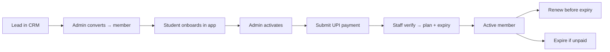

# Appendix — Academy Operations Handbook

> Practical day-to-day operations, derived from the implemented software workflows. Pairs with [17_Operations](../17_Operations.md). Policy specifics not in code are `[Needs Verification]`.

## Roles & who does what

| Role | Day-to-day |
|---|---|
| **Admin / owner** | Activate members, manage batches & holidays, verify/approve payments, run reports/CSV, manage CRM leads, edit website content (Sanity) |
| **Trainer** | Mark attendance, approve leave, verify payments, maintain therapeutic logs & diet guidance, manage their students/enrollments |
| **Student** | Check in (geofenced), submit payments, request leave, track progress, read notifications |

## Batch management

1. Admin creates a batch with **name, schedule/time, location coordinates (required), and radius**.
2. Students are **enrolled** into batches by staff (no self-booking today).
3. Attendance is marked per session; **streaks** update automatically.
4. **Holidays** are added by admin and suspend the schedule.

> Coordinates are mandatory (migration 016) because attendance is geofenced — always set them accurately.

## Attendance policy (as enforced)

- Student check-in only succeeds **within the batch radius** (default 100 m; configurable per batch).
- Staff can mark/adjust attendance (trainer/admin policies).
- Streaks reward consistency; recalculated by triggers on any attendance change.

## Membership lifecycle

## Fee handling (UPI, manual)

1. Show the **UPI QR** (academy account) — web Membership section / app.
2. Student pays via their UPI app and **uploads a screenshot**.
3. Staff **verify** the screenshot, then approve — which sets `plan_name`, receipt flags, and `plan_expiration_date`.
4. Student is **notified** of the status automatically.

> Integrity controls: payment fields are trigger-locked; status follows a fixed state machine (don't edit rows by hand). Refund handling is **`[Needs Verification]`** — define a policy.

## Leave handling

Student submits a leave request → trainer/admin approves or rejects → status visible to student.

## Communication

- Member updates flow via **in-app notifications + FCM push**.
- Inbound enquiries (website) arrive by **email (Brevo)**; quick contact via **WhatsApp**.
- No bulk SMS/marketing automation today (`[Needs Verification]`).

## Reporting

- Admin dashboard shows KPIs (members, attendance, payments).
- **CSV export** for payments/attendance for offline reconciliation.

## Pre-launch operational checklist

From [BETA_LAUNCH_CHECKLIST](../../Divinity/docs/BETA_LAUNCH_CHECKLIST.md) + website README:
- [ ] Real prices, plans, testimonials, contact/WhatsApp/Instagram set in content.
- [ ] Verified Brevo sender + key.
- [ ] Correct UPI QR (real account).
- [ ] Batches created with accurate coordinates.
- [ ] Admin/trainer accounts provisioned with correct roles.

## Open operational questions (`[Needs Verification]`)

Refund policy, support SLA, fee schedule, trainer onboarding/certification capture, data-retention for ex-members, audit logging of admin actions.
