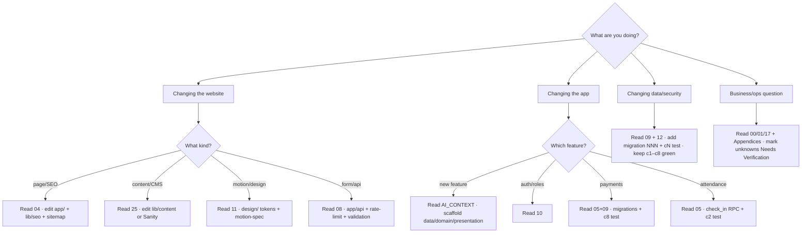

# Decision Tree — "Where do I work / what do I read?"

## Quick routing table

| Task | Read first | Then |
|---|---|---|
| Add a website route | [04_Public_Website](04_Public_Website.md) | update `nav.ts`, `seo.ts`, `sitemap.ts`, JSON-LD |
| Add an app feature | [AI_CONTEXT](AI_CONTEXT.md) + [MODULE_INDEX](MODULE_INDEX.md) | follow `data/domain/presentation`, add tests |
| Change schema | [09_Database](09_Database.md) | new migration + `cN` test, run security suite |
| Touch RLS/roles | [10](10_Auth_Authorization.md) + [12](12_Security.md) | use `is_admin`/`is_trainer`, keep c1–c8 green |
| Change payments | [05](05_Student_Mobile_App.md)+[09](09_Database.md) | migration + c8 test, mind locks/triggers |
| Wire an integration | [14_Integrations](14_Integrations.md) | keep web zero-config (fallbacks) |
| Deploy / CI | [15_DevOps_Infrastructure](15_DevOps_Infrastructure.md) | build live trees, not `Divinity/apps/*` |
| Business/legal fact | [01](01_Business_Product.md)/[26](26_Compliance_Legal.md) | confirm `[Needs Verification]`, don't guess |

## Which skill helps?

- App code: `Divinity:dart-flutter-patterns`, `Divinity:flutter-dart-code-review`.
- Web: `Divinity:nextjs-turbopack`, `Divinity:react-patterns`, `Divinity:frontend-design`.
- DB/security: `Divinity:postgres-patterns`, `Divinity:security-review`.
- Design/a11y: `Divinity:accessibility`, `Divinity:10k-checklist`, `Divinity:motion-ui`.
