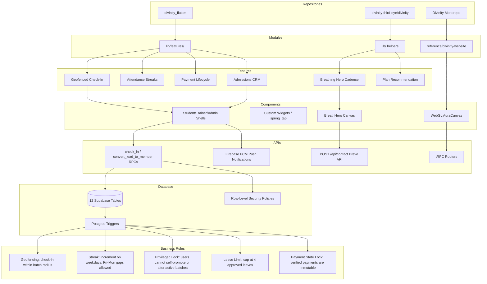

# Knowledge Graph — Divinity Ecosystem

This document maps the entire Divinity software architecture from repositories to operational business rules.

---

## 1. Structural Architecture Diagram

The diagram below visualizes the dependencies and relationships across the stack:

---

## 2. Layer Definitions & Relationships

### A. Repositories
*   [`divinity_flutter/`](file:///C:/Users/PC/OneDrive/Documents/Divinity%20TTE/divinity_flutter) — The live production Flutter repository representing the operational app.
*   [`divinity-third-eye/divinity/`](file:///C:/Users/PC/OneDrive/Documents/Divinity%20TTE/divinity-third-eye/divinity) — The live marketing website built on Next.js 14 App Router.
*   [`Divinity/`](file:///C:/Users/PC/OneDrive/Documents/Divinity%20TTE/Divinity) — The workspace root monorepo, holding developer guides, build scripts, archived `calling_app`, and the archived high-fidelity [`reference/divinity-website`](file:///C:/Users/PC/OneDrive/Documents/Divinity%20TTE/Divinity/reference/divinity-website).

### B. Modules
*   **Flutter features (`lib/features/`)**: A modular directory structure dividing business logic into 14 distinct feature folders (e.g. `attendance`, `payments`).
*   **Website core helpers (`lib/`)**: Isolated pure TypeScript modules for content CMS overrides, rate-limiting, and validation.
*   **WebGL Reference (`reference/divinity-website`)**: Archival tRPC next-app containing 3D canvas modules.

### C. Features
*   **Geofenced Check-In**: Enables students to check into scheduled batches on weekdays if coordinates are valid.
*   **Attendance Streaks**: Track consecutive student check-in streaks, adjusting for weekend gaps.
*   **Payment Lifecycle**: Uploads UPI screenshots, records payment state transitions, and notifies admins for verification.
*   **Admissions CRM**: Enables admins to register, update, and convert incoming leads into active academy users.
*   **Breathing Hero Cadence**: Signature marketing experience displaying a pranayama rhythm (inhale 4s, hold 4s, exhale 6s).
*   **Plan Recommendation**: Computes recommended memberships based on the user's primary wellness objective.

### D. Components
*   **Role Shells**: Student/Trainer/Admin UI tab navigations in Flutter.
*   **BreathHero**: Raw HTML5 canvas component rendering breathing ripples.
*   **WebGL AuraCanvas**: Custom GLSL shader rendering 3D particle energy.

### E. APIs
*   **RPCs**: Direct PostgreSQL functions `check_in` and `convert_lead_to_member` invoked via Supabase.
*   **Firebase FCM**: Push notification provider targeting mobile client tokens.
*   **Brevo Email API**: Backend endpoint executing contact form submissions.

### F. Database (Supabase)
*   **12 Tables**: `users`, `batches`, `leads`, `enrollments`, `attendance`, `leave_requests`, `payments`, `notifications`, `holidays`, `therapeutic_logs`, `transformation_scores`, `library_books`.
*   **RLS Policies**: Restricts access based on user role (`is_admin`, `is_trainer`).
*   **Triggers**: Postgres hooks automating audit logging, state updates, and push notifications.

### G. Business Rules
1.  **Geofencing constraint**: Check-ins are rejected if user distance from batch coordinates exceeds `radius_meters` (default 100m).
2.  **Consecutive check-in rule**: A student's streak is incremented if the check-in is consecutive. Fri-to-Mon gaps are treated as consecutive. All other gaps reset the streak.
3.  **Privileged-field lock**: Triggers prevent non-admin users from self-promoting roles or completing onboarding without validation.
4.  **Leave balance cap**: A user is restricted to a maximum of 4 approved leaves.
5.  **Payment immutability**: Once a payment record status transitions to `Verified`, it is permanently locked against modifications.
