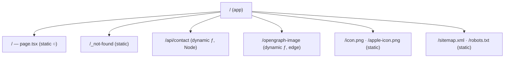
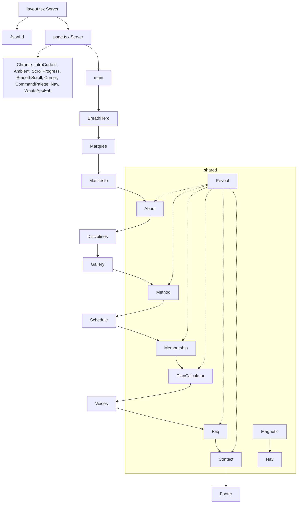
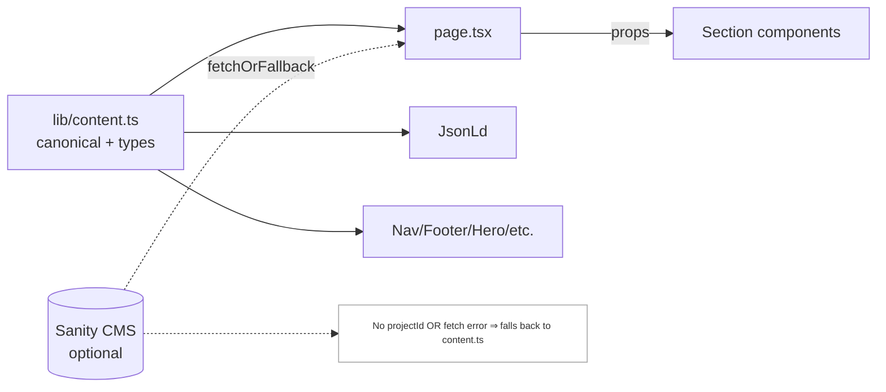
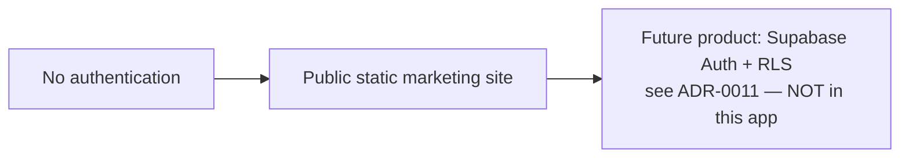
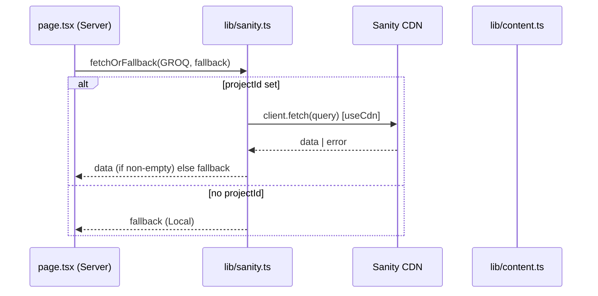
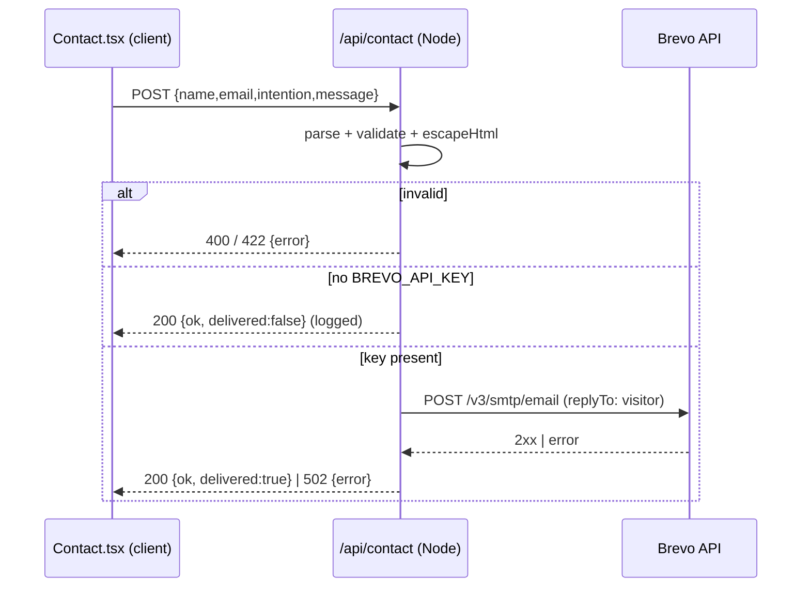
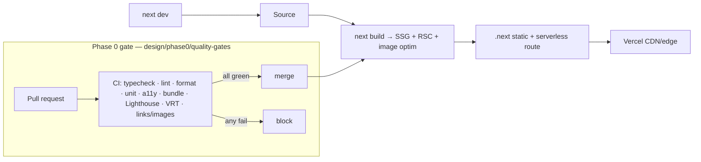

# Architecture Snapshot (Phase 0)

Reference diagrams for the frozen build (Mermaid — renders on GitHub). These are the baseline for future ADRs.

## 1. Folder structure
```
divinity/
├─ app/
│  ├─ layout.tsx           # Server — fonts, metadata, JsonLd
│  ├─ page.tsx             # Server — fetchOrFallback + section assembly
│  ├─ globals.css          # tokens + base styles
│  ├─ opengraph-image.tsx  # edge OG image
│  ├─ sitemap.ts · robots.ts
│  └─ api/contact/route.ts # Node — Brevo (or fallback)
├─ components/             # 24 components (client islands + utils)
├─ lib/
│  ├─ content.ts           # canonical content + types
│  └─ sanity.ts            # fetchOrFallback (CMS-or-fallback)
├─ sanity/schemas/         # schemas for an optional Studio
├─ public/                 # brand, founder, studio/, guru/, payment-qr
├─ design/                 # this dossier (+ phase0/)
└─ config: next.config.mjs · tailwind.config.ts · tsconfig.json · postcss.config.mjs
```

## 2. Route tree


## 3. Component hierarchy (render tree)


## 4. Data flow (content)


## 5. Authentication flow

**There is no auth in the current build** (intentional — ADR-0001). Diagram documents the absence + future path.

## 6. CMS flow


## 7. API flow (contact)


## 8. Build & deploy pipeline (current + proposed gate)

