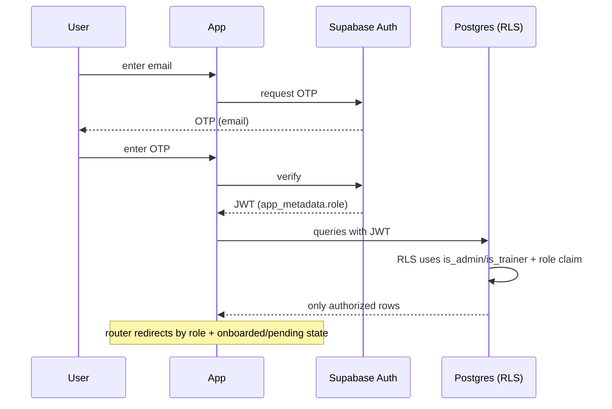

# Phase 10 — Authentication & Authorization

> Sources: [`lib/features/auth/`](../flutter-app/lib/features/auth/), migrations 001/012/017/018/019/025, [SECURITY_REVIEW_C1_C2](../Divinity/docs/SECURITY_REVIEW_C1_C2.md), [auth_migration_strategy](auth_migration_strategy.md).

## Login & Extensible Authentication

- **Mechanism:** Supabase Auth with a provider-agnostic, extensible architecture.
- **Supported Methods:**
  - **Email + Password**: Fully supported with strong password validation (length, cases, numbers, symbols) and reset flows.
  - **Phone OTP**: Preserved passwordless entry (`login_screen.dart`, `otp_screen.dart`).
  - **Google Sign-In**: Integrated via Supabase OAuth redirects.
  - **Apple Sign-In**: Supported on iOS.
- **Configurability:** Toggle providers dynamically via Firebase Remote Config parameter flags (`auth_enable_email`, `auth_enable_google`, etc.) without client code changes.
- **First Auth:** `handle_new_user` trigger (migration 001/025) automatically creates a `public.users` profile row and populates the `auth_provider` column.
- **Onboarding:** New users must go through an **onboarding wizard** (`onboarding_wizard.dart`) before they get approved by the admin.

## OAuth

- Integrated Google and Apple Sign-In via Supabase OAuth redirections. Configure client credentials in the Supabase Dashboard. Refer to [Migration Strategy](auth_migration_strategy.md).

## Sessions

- Supabase issues a JWT; the app persists the session (Supabase client + `shared_preferences`).
- **Role travels in the JWT** `app_metadata.role`, kept in sync by trigger `sync_user_role_to_auth` (migration 017) so RLS can read it without recursive table lookups.

## Roles

Three roles, encoded on `users.role` and mirrored to JWT:
- **student** — default; consumes batches, attendance, payments, progress.
- **trainer** — manages assigned students, attendance, payments read/update, therapeutic logs.
- **admin** — full management: students, trainers, batches, leads, payments, holidays, reports.

Role shells select the navigation set: `student_shell`, `trainer_shell`, `admin_shell` (via `role_shell.dart`).

## Permissions

Authorization is enforced **in the database** via RLS + `SECURITY DEFINER` helpers `is_admin`, `is_trainer`, `is_trainer_or_admin` (migrations 012/017). The UI mirrors these but is **not** the enforcement point. Privileged fields are write-locked by triggers.

## Access Matrix

| Resource | Student | Trainer | Admin |
|---|---|---|---|
| Own profile | R/W (non-privileged) | R/W own | R/W all |
| Other students | — | R (their students) | R/W all |
| Batches | R | R + update own | R/W all |
| Enrollments | R | Create/Delete | R/W all |
| Attendance | Insert own (geofenced) + R | Insert/Update (staff) | R/W all |
| Leave requests | Create + R own | Approve/Update | R/W all |
| Payments | Insert own + R own | Read all + Update | R/W all |
| Leads (CRM) | — | — | R/W all |
| Therapeutic logs | R own | Create/Comment | R/W all |
| Transformation scores | R own | R/W | R/W all |
| Notifications | R/W own | Insert | R all + Insert |
| Holidays | R | R | Insert/Delete |

(Derived from the RLS policy names in migrations 001–023; see [09_Database](09_Database.md).)

## Security Flows

Verified by security tests: `c4_jwt_role_test`, `c1_privileged_fields_test`, `c5_latches_test` (onboarding latches). See [12_Security](12_Security.md).
